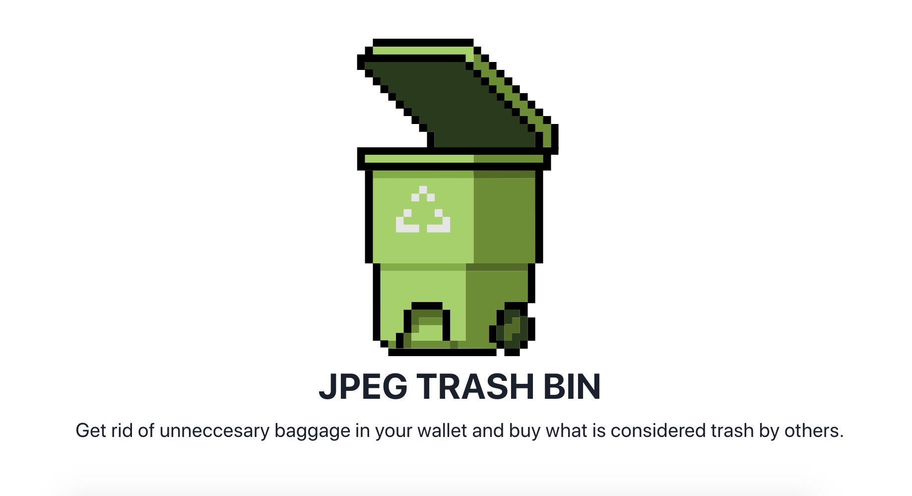

# TrashBin
The JPEG TRASH BIN is a tax loss harvesting tool built with ❤️ by Hashes DAO.

Try it out [now!](https://www.jpegtrashbin.xyz/)

Deployed on Ethereum Mainnet at [0xf43a8DD18Bf488825caE7E8B5A8693e3423fE4f5](https://etherscan.io/address/0xf43a8dd18bf488825cae7e8b5a8693e3423fe4f5)

### Guides

[What is this …?](https://jpegtrashbin.medium.com/what-is-this-fd027b649973)

[How to use me?](https://jpegtrashbin.medium.com/how-to-use-me-4c9eecee7e6)

### Installation

- Clone the repo

- Follow all instructions on this [page](https://hardhat.org/tutorial/creating-a-new-hardhat-project) beginning from run `npm init`/`yarn init`

- Install OpenZepplin via command from root of repo `npm i @openzeppelin/contracts`

- Ensure that your compiler has enabled using the optimiser on `hardhat.config.js`. More information found [here](https://hardhat.org/hardhat-runner/docs/guides/compile-contracts)

- For live deployment follow all instructions on this [page](https://hardhat.org/tutorial/deploying-to-a-live-network). More information regarding deployment and verification found [here](https://hardhat.org/hardhat-runner/docs/guides/deploying) and [here](https://hardhat.org/hardhat-runner/docs/guides/verifying)

### Security

Independently audited by PopBlocks.

Local testing via command `npx hardhat test ./test/TrashBin.js`

### Socials

[JPEG TRASH BIN](https://twitter.com/jpgtrashbin)